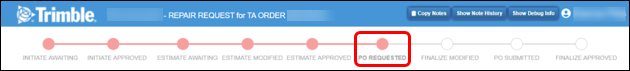
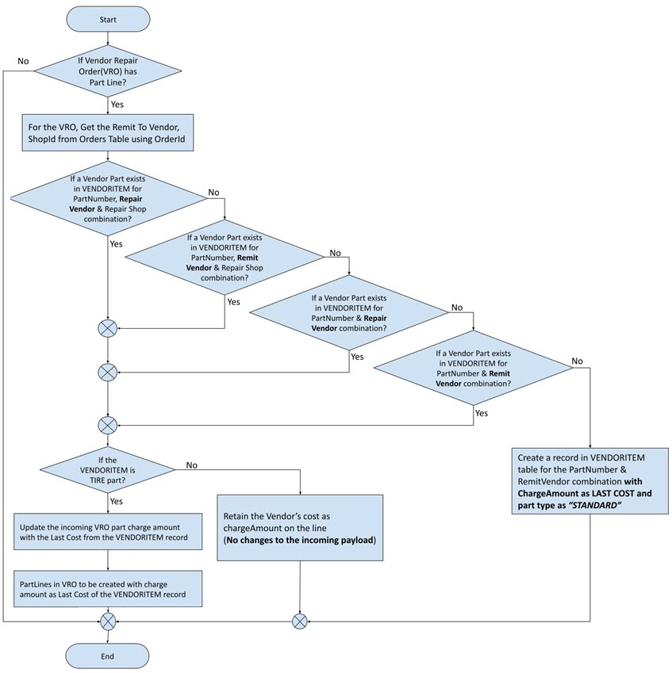
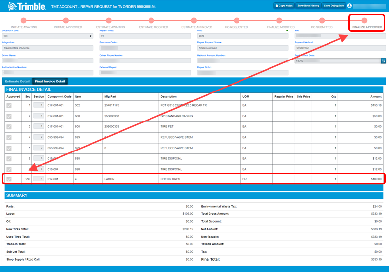

= Pay for the repair

When the repair(s) are completed, TravelCenters of America (TA) sends data to TMT stating that the repairs are complete. The repair request status changes to _PO Requested_.

. TMT receives the _Finalized Awaiting_ notification from TA. TMT moves the repair request into _PO Requested_ status and sends an email to the appropriate TMT email group.

. A member of the TMT email group opens the email, selects the VRO link to open it, and reviews the *Final Invoice Detail* tab in the repair request. They may also select the VRO from the VRO Listing.
 +
The *Final Invoice Detail* tab displays all the lines approved from the estimate and allows the TMT user to define the VRO Section number to assign to each line. The *Final Invoice Detail* tab is not displayed until the Repair Request form is in _PO Requested_ status.

. The TMT user clicks the *Review* button. +
This opens the *Finalize Awaiting* window.

. The TMT user reviews the lines in the tab and approves or declines them.

** Selecting a line's checkbox approves the line.
** Deselecting a line's checkbox declines the line.

. If the TMT user declines any lines and clicks *Submit*, the repair request status changes to _Finalized Modified_. TMT sends the revisions to TA.

. TA revises the charges and sends the final invoice back to TMT.

. When TMT receives the updated invoice, it sends an email to the TMT email group. A TMT user reviews the Repair Request for final approval.

. The TMT user opens the *Finalize Awaiting* window, reviews the lines, and approves or declines them. +
TA and TMT repeat this process until all lines are approved.

. The TMT user submits a PO number to TA. To submit the PO number, the TMT user must:

** Open the *Finalize Awaiting* window.
** Approve all the lines.
** Enter a note in the *Comments* field, such as _Approved._
** Select *Submit*.
+
TMT sends the purchase order number and final invoice detail to TA. The Repair Request status changes from _PO Requested_ to _PO Submitted_. When the status changes to _PO Submitted_, TA no longer accepts any more changes such as meter updates, changes to the final invoice detail lines, and so on.

. When TA receives and processes the PO number, it closes the TA Work Order. +
The Work Order can no longer be changed. In some cases, there may be a delay. The VRO sections are not populated immediately if the TA Shop location is closed. In this event, the finalized invoice may not be closed out until the shop opens again.

. The TA agent reviews and finalizes the payout in the Shop TA System. TA sends new data to TMT. This populates the VRO Sections and detail lines in the TMT VRO. The repair request's status changes to _Finalized Approved_.

. TMT sends an email to the TMT email group. A TMT user:

** Opens the email.
** Selects the VRO in the email to open it.
** Reviews the VRO Sections.
** Closes the VRO.

This flowchart helps you review the VRO part charges and pricing. It also includes a decision path if a new Vendor Part record needs to be created.

This table reviews the *Finalize Awaiting* pop-up window fields:

[width="100%",cols="3s,7",options="header",]
|===
|Field |Definition
|Comments |Comments about the repair request, such as _Approved_
|Driver Name |The driver's first and last name
|Driver Phone Number |The phone number where the driver can be reached
|National Account Number |The customer's national tire account number to be used for invoicing purposes

This field is an open text field. You can edit it until the repair request reaches the _Finalize Approved_ step in the TA workflow.

If the customer does not enter a tire account number that is valid in the TA system, then TA updates the value to a valid number for your company automatically after the current step is submitted.

|Tech/Truck Arrival Date |The estimated date and time of arrival based on the repair site:

*Tech Arrival Date* shows the date and time the technician is expected to arrive at the unit's location. This data is provided by TA.

*Truck Arrival Date* shows the date and time the unit is expected to arrive at the TA shop location. This data is provided by the TMT user.

|Authorization Number |This field defaults to the VRO number. After the estimated awaiting step, this field is read-only.
|Approved a|Indicates if the line is:

_Approved_ (checkbox is selected)

_Approved_ (checkbox is selected and read-only)

_Declined_ (checkbox is not selected)

|Seq |The TA line sequence*
|Section a|Indicates the section number the line will be added to when the VRO sections are created

*Notes:*

By default, the section number is predefined to group all lines with the same component code to the same section. The TMT user may choose to change the section number for any line to move those lines to other sections.

Valid section numbers are 1 - 99.

You cannot skip section numbers. For example, if Section number assignments exist for Section 1, 2, and 3, then the next Section number you can add is 4. You cannot assign Section 5 until there is an assignment for Section 4.

|Component Code |The VMRS Component Code*
|Item |The item's SKU number*
|Mfg Part |The manufacturer part number*
|Description |The part description*
|UOM |The unit of measure (UOM) value*
|Regular Price |The regular price of the item +
(Not currently supported by TA)
|Sale Price |The sale price of the item +
(Not currently supported by TA)
|Qty |The quantity based on the UOM for the item*
|Amount |The customer's extended total price for the item*
|===

*Field values provided by TA.

== Finalized Approved Status

The final labor line (marked _999_, as shown in this illustration) is added by TA during the _Finalize Awaiting_ status. The lines in the *Final Invoice Detail* tab automatically show the *Approved* check mark when the work order has been paid out by TA and the status is _Finalized Approved_.

Once the repair request reaches the _Finalize Approved_ step in the TA workflow, the repair process is complete.